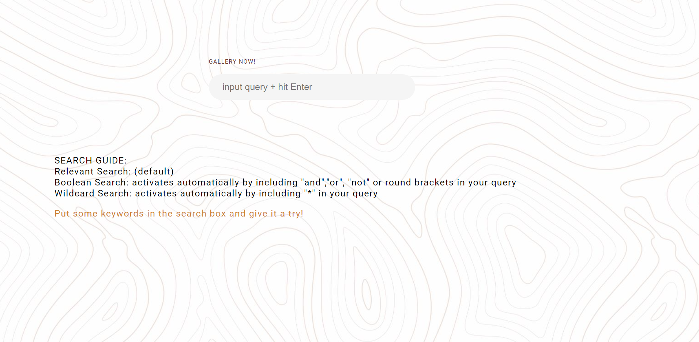
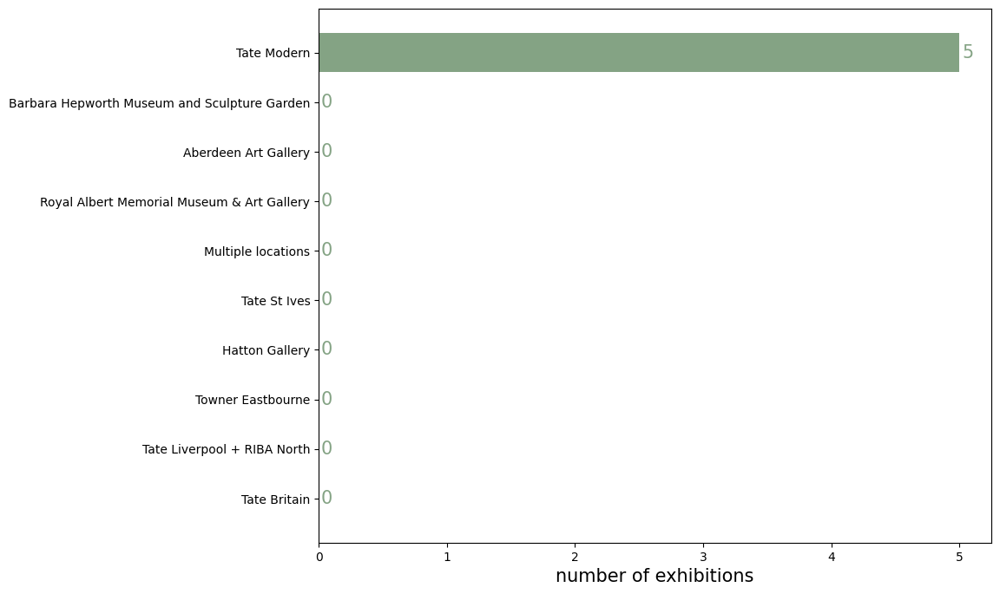
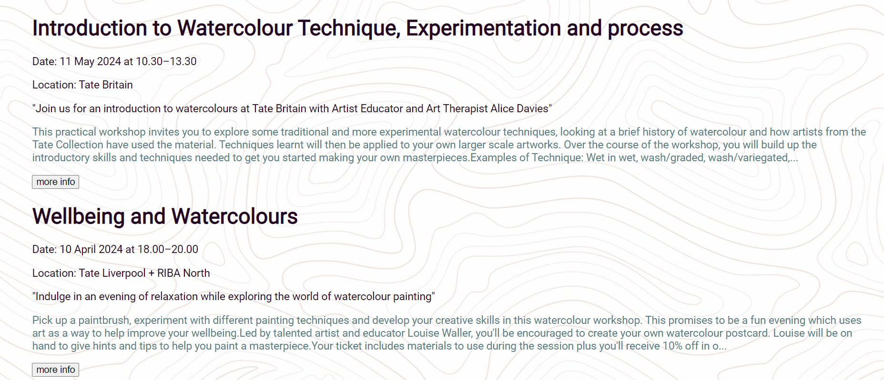

# About our project:

Hi! We are team IKEA Meatballs!
Our project is a search engine for on-going art exhibitions at different branches of Tate galleries.
You can search for exhibition info with a query!

Based on the search results found, a bar chart will be generated, showing the distribution (i.e., numbers) of relevant exhibition(s) at each of Tate's branch galleries; for each exhibition in the search results, the following information will be displayed:

1. the exhibition name
2. time period
3. location
4. a brief summary about the exhibition's content
5. a snapshot of an intro article
6. and by clicking to the "more info" button shown below each piece of search result, you can access Tate's website for that specific exhibition

The search engine has 3 different search modes. Search mode will be automatically selected based on the content of the query (and the activated search mode for an input query will be displayed). The search modes include the following:

1. Relevance Search (the default mode)
2. Boolean Search (activated automatically if the query contains logic operator(s), including 'and', 'or', 'not', and brackets)\*
3. Wildcard Search (activated automatically if the query contains "\*")

\*NOTE: to activate the Boolean Search mode, the logic operator in a query needs to be used in an acceptable way (e.g., a query such as "and cat" will be considered illegal, and the Boolean Search mode will not be activated. Instead, Relevance Search will take over in this case.)

## How to run the search engine:

Our search engine is not a public website; it can only run on a local device.
To run this search engine, one needs to set up and activate a virtual environment, and install Flask.

### To set up

For Mac users:

```
python3 -m venv demoenv
. demoenv/bin/activate
pip install Flask
```

For Windows users:

```
py -3 -m venv demoenv
demoenv/Scripts/activate
pip install Flask
```

### Running the project

After everything has been set, let's start running the search engine!
Here is an example of how to run it:

The project directory is called "Final_Project", which is under the cloned repository "IKEA-meatballs-main":

```
git clone git@github.com:zccwqdoorchid/IKEA-meatballs.git
cd IKEA-meatballs-main\Final_Project
```

Then, set up the following environment variables and run Flask:

On Linux terminal

```
export FLASK_APP=combined_search.py
export FLASK_DEBUG=True
export FLASK_RUN_PORT=5000
flask run
```

On Windows command line:

```
set FLASK_APP=combined_search.py
set FLASK_DEMO=True
set FLASK_RUN_PORT=5000
flask run
```

On Windows PowerShell:

```
$env:FLASK_APP = "combined_search.py"
$env:FLASK_DEMO = "True"
$env:FLASK_RUN_PORT = "5000"
flask run
```

After that, open a browser and go to "http://127.0.0.1:5000". Now the search engine is at your disposal.

## Demo example:

If everything went well, the browser should display this home page:


By clicking on the "start searching" button on the home page, it goes to the search page:


And here is an example of search results displayed after inputting a query:



