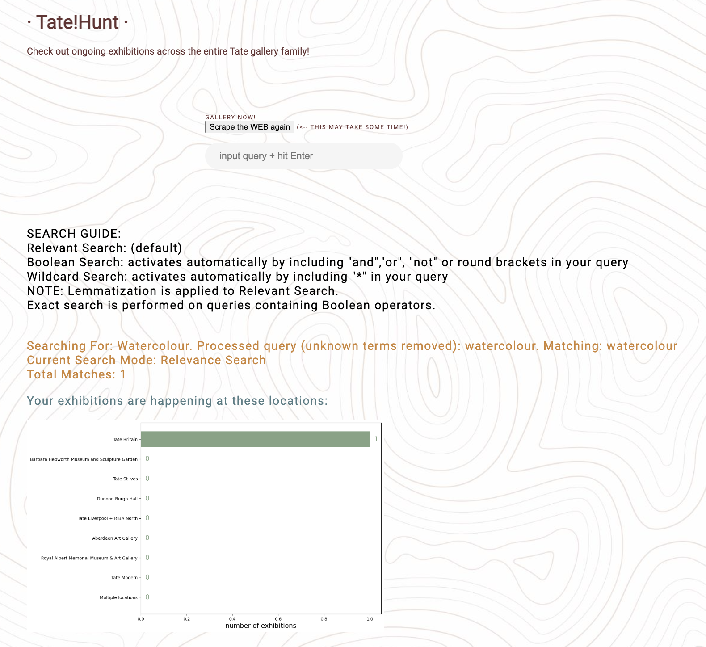

# About our project:

This is a continuation of a team-project IKEA Meatballs (https://github.com/zccwqdoorchid/IKEA-meatballs/tree/main/Final_Project) by XinyanMO, nicksnlp, and zccwqdoorchid.

The project runs on <strong>flask</strong> and requires the following libraries:  <strong>scikit-learn, spacy, beautifulsoup, matplotlib </strong>.

The following improvements have been made:

1. Wildcard search, bugs fixed.
2. Boolean search, bugs fixed.
3. The structure of the project: the functions are moved into a class GallerySearch within gallery_search.py, from where the call of the web_scraping.py and data_visualization.py are initiated.
4. The main flask_app.py handles the html, and feeds the url-link and the query from user into the gallery_search.py.
5. Scraping data is saved into an external scraped_data.json, as a dictionary. If it is not present there, the new scraping is initiated (may take around 5 minutes to complete).
6. "Scrape the WEB again" button on the loading page. Removes the data, initiates the new scraping process.
7. Old plot-files are deleted on restart and/or after new scraping initiated.
8. Project is deployed on [nicksnlp.pythonanywhere.com](http://nicksnlp.pythonanywhere.com/)
9. Search structure modified, queries preprocessing added, that removes unknown words.
10. Lemmatisation included into all search modes.

This way the project can be easier handled by web hosting environments, and/or incorporated into other applications.

POSSIBLE FUTURE IMPROVEMENTS:

12. Improve Boolean search.

11. highlight words found in the text

### Running the project:

The project can be run with the following commands:

Mac/Linux users:

Setting up the environment (python3 is already installed):

```
python3 -m venv demoenv
. demoenv/bin/activate
pip install Flask
pip install -U spacy
python -m spacy download en_core_web_sm
pip install beautifulsoup4
pip install -U scikit-learn
pip install -U matplotlib
```

clone the repository:
```
git clone git@github.com:nicksnlp/arthunt.git
cd arthunt
```

Run the flask:
```
export FLASK_APP=flask_app.py  
export FLASK_DEBUG=True  
export FLASK_RUN_PORT=8000
```

Then in your browser open: http://127.0.0.1:8000


# A detailed description of the project:

This project is a search engine for on-going and upcoming art exhibitions at different branches of Tate galleries. You can search for exhibition info with a query!

The search is based on data from scraping tate.org.uk website. The data is saved in .json format, which speeds-up the launch of the program. A new search can be initiated by pressing "Scape the WEB again" button on the search-page (this is performed automatically in case the data is missing for some reason, e.g. interrupted process in the previous session). Depending on whether the scraping-process succeeds or not, the relevant message is displayed under the search bar.

Based on the search results found, a bar chart will be generated, showing the distribution (i.e., numbers) of relevant exhibition(s) at each of Tate's branch galleries; for each exhibition in the search results, the following information will be displayed:

1. the exhibition name
2. people names and other entities mentioned in the article
3. time period
4. location
5. a brief summary about the exhibition's content
6. a snapshot of an intro article
7. and by clicking to the "more info" button shown below each piece of search result, you can access Tate's website for that specific exhibition

The search engine has 4 different search modes. Search mode will be automatically selected based on the content of the query (and the activated search mode for an input query will be displayed). The search modes include the following:

1. Relevance Search
2. Boolean Search (activated automatically if the query contains logic operator(s), including 'and', 'or', 'not', and brackets)\*

and combination of those with Wildcard search:

3. Wildcard + Relevance Search (activated automatically if the query contains "\*")
4. Wildcard + Boolean Search (activated automatically if the query contains "\*" + logic operator)

In this updated version lemmatisation is applied to all the search modes.

Also, in the updated version, a preprocessing of queries has been added. It effectively activates search when receiving queries like: "and cat", as well as removes unknown words from the query, including in those with "*". This is displayed in the output.

## Demo example:

If everything went well, the browser should display this home page:


By clicking on the "start searching" button on the home page, it goes to the search page:


And here is an example of search results displayed after inputting the query "Watercolour":

1. a bar chart that shows how many on-going/upcoming exhibitions related to "Watercolour" are at each of the branch galleries:
   
2. and the information about each related exhibition:
   
